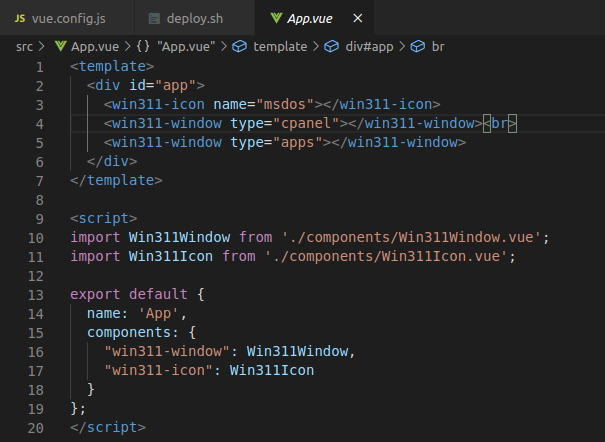

# dsi-p6-win311-alu0100833010

_Práctica 6.  VueJS._

## Descripción de la Práctica  dsi-p6-win311.

### ¿Qué es VueJS? 

**VueJS** es un _framework_ progresivo para construir interfaces de usuario. A diferencia de otros frameworks monolíticos,
**Vue** está diseñado desde cero para ser utilizado incrementalmente. La librería central está enfocada solo en la capa de
visualización, y es fácil de utilizar e integrar con otras librerías o proyectos existentes. Por otro lado, Vue también es
perfectamente capaz de impulsar sofisticadas _Single-Page Applications_ cuando se utiliza en combinación con herramientas
modernas y librerías de apoyo. 

* **Vue-CLI**:

**Vue-CLI** (interfaz de línea de comandos de _Vue_) es una herramienta creada por **VueJS** que facilita el rápido desarrollo de
las aplicaciones de _Vue_. Nos permite comenzar un proyecto de inmediato sin tener que preocuparnos de diferentes herramientas de
compilación.

* **Objetivo**:

En esta práctica, vamos a utilizar VueJS y su sistema de componentes para crear una imitación visual del sistema de ventanas
del entorno gráfico de Windows 3.11.

## Comenzando

### 1. Crea un proyecto con VueJS.

Para ello comenzamos creando la estructura del proyecto.

#### Pasos para crear el proyecto.

* **Instalación de Vue-CLI** 

  ```
  // Instalamos vue en nuestro sistema
  npm install -g @vue-cli
  ```
  Comprobamos que se ha instalado correctamente:
  ```
  vue --version
  ```
  
* **VueJS**

  Creamos el repo usando el comando `vue`:
  
  ```
  vue create dsi-p6-win311-alu0100833010
  ```
  Nos situamos en el repo:
   ```
  cd dsi-p6-win311-alu0100833010
  ```

Automáticamente se nos crea una estructura del proyecto:
  
  
 
A diferencia de _Parcel_, para correr el servidor ejecutamos el comando:

```
npm run serve
```

Inicialmente, **VueJS** nos muestra una pantalla de bienvenida.

  
  
* **Producción**
```
npm run build
```

* **Linters**
```
npm run lint
```

See [Configuration Reference](https://cli.vuejs.org/config/).
  
### 2. Código _HTML_.

La estrucutura de `index.html` es la siguiente:

 
 
Por defecto, **VueJS** nos crea un archivo `index.html` muy sencillo que sirve como _plantilla_. **VueJS** añade a este archivo
los elementos que necesita que están dentro de la parte de Vue. 

Debemos tener en cuenta el `<div id="app"></div>`, ya que es el contenedor que va a recibir toda la información proveniente de los 
componentes de Vue. Es donde se monta toda la aplicación.

### 3. Código _Javascript_.

Utilizando **VueJS**, creamos los componentes **Win311Window** y **Win311Icon**:

 
 
* `main.js`:

 
 
Sería equivalente al `index.js` que hemos utilizado en las prácticas anteriores. Contiene el núcleo de la parte de **VueJS**. En
este archivo se importa la librería Vue y el fichero `App.vue` que corresponde con el _componente_ principal de la aplicación. 

```
new Vue({
  render: h => h(App)
}).$mount('#app')
```
Se crea una instancia de Vue que es la que utilizará la aplicación y le indica donde ha de montarla, en este caso, en el
elemento _HTML_ con el mismo nombre que vimos en `index.html`. 

### 3. Componentes.

Una de las características más importantes de Vue es el trabajo con componentes. Un componente de _Vue_ es un elemento que 
encapsula código reutilizable. Dentro de un componente podemos encontrar etiquetas _HTML_, estilos de _CSS_ y código _Javascript_.

Antes de ver el código de la práctica, un componente simple de _Vue_ posee 3 secciones: _HTML_, _CSS_ y _Javascript_:
```
<template>
  <h1 class="text"> Plantilla de Vue </h1>
</template>

<script>
</script>

<style>
</style>
```
* `App.vue`:


 
`App.vue` es el componente principal de toda la aplicación. Como mencionamos antes, la estructura del archivo está dividida en
`<template></template>`, `<script></script>` y `<style></style>`.

En `<template></template>` se encuentra el código _HTML_ de la página. Solo debe haber un único elemento hijo, en este caso, 
`<div id="app"></div>`. Dentro de él, encontramos las etiquetas correspondientes con el resto de componentes de la aplicación, 
`<win311-icon>` y `<win311-window>`, en el que a ambos se les indica un prop que hace referencia a `windows.json`.

Por otro lado, en `<script></script>`, damos nombre al componente principal e indicamos los componentes locales que tenemos.


Dentro `<style></style>`, se encuentra el código _CSS_ para darle estilo a toda la página.

* *`windows.json`: 

  ```
  {                       
    "apps": {
        "title": "Application",
        "icons": ["paintbrush", "calc", "write", "notepad", "clock"]
    },
    "cpanel": {
        "title": "Control Panel",
        "icons": [
            "calendar",
            "charmap",
            "clipboard",
            "colors",
            "desktop",
            "keyboard",
            "cd",
            "fonts",
            "international",
            "programs"
        ]
    },
    "games": {
        "title": "Games",
        "icons": ["minesweeper", "solitaire","mshearts"]
    }

  }
  ```
  Este _json_ lo que hace es especificar que título y que iconos va a tener cada ventana.
  
### 5. Publicación en _gh-pages_.
 
Para publicar nuestro proyecto en **gh-pages**, ejecutamos los siguientes comandos:
```
$ npx parcel build src/index.html --no-minify
$ npx parcel build src/index.html --no-source-maps --detailed-report
$ npx parcel build src/index.html --public-url /dsi-p4-pokedex-alu0100833010/ -d build
$ npx gh-pages -d build
```


Enlace:  https://ull-esit-dsi-1920.github.io/dsi-p4-pokedex-alu0100833010/

### 6. Retos.

#### Reto 1.

Busca plugins de PostCSS que consideres interesantes y documentalos en el `README.md` con un enlace a su GitHub y una breve
descripción de lo que hacen y para que podría serte útil.

* **PreCSS**

Al activar **PreCSS**, puedes obtener las características de un pre-procesador, de este modo puedes aprovechar de la sintaxis de
Sass en tus hojas de estilo. Esto implica que puedes hacer uso de diversas funciones y características propias de esta sintaxis.

Enlace Github: https://github.com/jonathantneal/precss

* **Stylelint**

**Stylelint** es un moderno corrector de código _CSS_ que revisará y validará tus archivos _CSS_. Ayuda a evitar errores comunes y
mejorar tus hojas de estilo. También realiza una configuración personalizada al momento de realizar la validación del código.

Enlace Github: https://github.com/stylelint/stylelint

* **Lost Grid**

**Lost Grid** es un plugin que permite trabajar con sistemas de grillas que son compatibles no sólo con _CSS_, sino también con la
sintaxis de pre-procesadores populares como _Sass_ o _Less_. Puedes crear grillas sin invertir mucho tiempo por medio de la
función calc().

Enlace Github: https://github.com/peterramsing/lost
